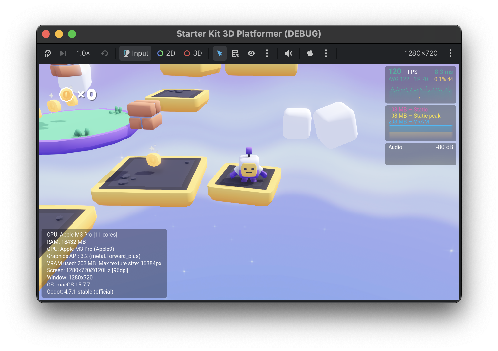

<div align="center">

# Profily

### FPS counter, performance monitor & debugger overlay for Godot 4

[](https://godotengine.org/)
[](addons/profily/plugin.cfg)
[](LICENSE)


**Profily** is an easy to use, feature-packed **FPS counter**, **stats monitor**
and **debugger** for your Godot project: real-time **FPS**, **RAM & VRAM**,
**audio spectrum**, **hardware info** and **scene stats** in a configurable
in-game overlay — 100% statically typed GDScript, zero dependencies.

Godot port of [**Graphy — Ultimate Stats Monitor**](https://github.com/Tayx94/graphy)
by [Martín Pane](https://github.com/Tayx94) (MIT), winner of the
**Best Development Asset** award at the Unity Awards 2018.



</div>

## Table of contents

- [Features](#features)
- [Installation](#installation)
- [Quick start](#quick-start)
- [Usage](#usage)
  - [Option A — Autoload (plugin)](#option-a--autoload-plugin-recommended)
  - [Option B — Drop-in scene](#option-b--drop-in-scene)
- [Configuration](#configuration)
- [Runtime API](#runtime-api)
- [Debugger](#debugger)
- [Differences from Graphy (Unity)](#differences-from-graphy-unity)
- [Known limitations](#known-limitations)
- [Demo & development](#demo--development)
- [AI usage](#ai-usage)
- [Author](#author)
- [License & attribution](#license--attribution)

## Features

- **FPS module** — current FPS, ms per frame, average, **1% low** and
  **0.1% low** over a 1024-sample window, color-coded by configurable
  thresholds, plus a shader-based graph with a decaying-peak scale (faithful
  port of Graphy's graph shader).
- **RAM module** — static memory, static peak and **VRAM** usage as three
  overlaid graph series.
- **Audio module** — dB readout and an 81-bar **spectrum analyzer** with
  peak-hold for any audio bus. The `AudioEffectSpectrumAnalyzer` is added to
  the bus only while the module is active and removed when it is not.
- **Advanced module** — CPU model & core count, physical RAM, GPU,
  graphics API and renderer, VRAM used / max texture size, screen & window
  info, OS, Godot version, and XR target size when active. Auto-sizing panel.
- **Scene module** *(Godot exclusive, off by default)* — **draw calls**
  (with graph), objects & primitives in frame, node and orphan node counts,
  active physics objects.
- **Debugger** — declarative condition packets (*"if FPS < 25 for the
  first time after 2 s → warning + screenshot + callback"*) with ALL/ANY
  evaluation, one-shot or recurring execution, and signals.
- **12 rotating presets** and per-module **FULL / TEXT / BASIC /
  BACKGROUND / OFF** states.
- **4 anchored corners** (+ FREE placement) with safe-area support for
  notched screens, background toggle and UI scaling.
- **Hot-reloadable everything** — every option can be changed at runtime
  from code, and configured beforehand in the Inspector or Project Settings.
- **Two integration paths** — enable the plugin (autoload) *or* drop a
  scene where you need it. Both can coexist safely.
- **100% statically typed GDScript**, zero dependencies, MIT licensed.

## Installation

1. **Get Profily** from the
   [**Godot Asset Store**](https://store.godotengine.org/asset/javier-garrido/profily/)
   or from this repository (`Code ▾ → Download ZIP`, or clone it).
2. **Copy** the `addons/profily/` folder into the `addons/` directory of your
   Godot project (create it if it does not exist).
3. *(Recommended)* **Enable the plugin** under
   **Project → Project Settings → Plugins → Profily**.

That's it — no dependencies, no extra setup. Works with **Godot 4.6+**.

## Quick start

Enable the plugin and press play. Profily shows up immediately with sensible
defaults and two hotkeys out of the box:

| Hotkey | Action |
| ------ | ------ |
| `Ctrl+G` | Rotate through the 12 module presets |
| `Ctrl+H` | Show / hide Profily |

Both are remappable in the **Hotkeys** group (or can be disabled entirely).

```gdscript
# Live values:
print(Profily.current_fps, " avg=", Profily.average_fps)

# Change anything at runtime:
Profily.fps_module_state = Profily.ModuleState.TEXT
Profily.graph_modules_position = Profily.ModulePosition.BOTTOM_RIGHT
Profily.good_fps_threshold = 90
Profily.set_preset(Profily.ModulePreset.FPS_FULL_RAM_FULL)
Profily.scene_module_state = Profily.ModuleState.FULL # Godot-only module
```

## Usage

### Option A — Autoload (plugin, recommended)

Enable **Project Settings → Plugins → Profily**. The plugin registers the
`Profily` autoload and its settings under **Project Settings → Profily**:
zero setup, the overlay is available on every scene, and you get the global
`Profily.*` API anywhere in your code:

```gdscript
Profily.fps_module_state = Profily.ModuleState.TEXT
```

### Option B — Drop-in scene

Prefer the overlay only in specific scenes (or don't want a plugin)? Drag
`addons/profily/profily.tscn` into any scene and it works there at runtime —
no plugin needed. It reads your `profily/*` project settings if present, or
its Inspector values otherwise. Access the API through the static singleton,
which works in **both** modes:

```gdscript
ProfilyManager.instance.fps_module_state = ProfilyManager.ModuleState.TEXT
```

> **Both at once?** The first Profily to enter the tree wins: if the autoload
> is active and a scene also contains a copy (or two scenes do), the extra
> instance removes itself with a warning. You can safely keep the scene in
> your levels and enable/disable the plugin without ever getting a double
> overlay.

## Configuration

Three ways, mirroring the original Graphy workflow:

1. **Inspector (Unity-style).** Select the `Profily` node (your dropped
   instance, or open `profily.tscn`) and edit the grouped properties —
   *General, Hotkeys, FPS, RAM, Audio, Advanced, Scene (Godot extra),
   Debugger* — laid out like the original GraphyManager inspector (states,
   thresholds with their colors, resolutions, update rates…). Edits on an
   instance are stored as overrides in **your** scene, so addon updates never
   lose them.
2. **Project Settings.** With the plugin enabled, every option also lives
   under `profily/*`. Registered keys override the Inspector values on
   startup; set the node's `settings_source` to `Inspector` if you want the
   Inspector to win anyway.
3. **Runtime API.** Every property is hot-reloadable from code:
   `Profily.*` (autoload) or `ProfilyManager.instance.*` (any mode).

## Runtime API

Everything below works on `Profily` (autoload) or `ProfilyManager.instance`.

**Read-only data:** `current_fps`, `average_fps`, `one_percent_fps`,
`zero1_percent_fps`, `allocated_ram`, `reserved_ram`, `vram`, `max_db`,
`spectrum`, `draw_calls`, `node_count`, `orphan_node_count`, `is_active`.

**Methods:** `set_preset(preset)`, `current_preset()`, `toggle_modes()` (the
`Ctrl+G` action), `set_module_mode(module, state)`,
`set_module_position(module, position)`, `enable()`, `disable()`,
`toggle_active()` (the `Ctrl+H` action), `add_debug_packet(packet)`.

**Signals:** `initialized`, `active_toggled(active)`,
`preset_changed(preset)`, `module_state_changed(module, state)`,
`debugger.packet_executed(packet)`.

## Debugger

Attach condition packets that watch your stats every frame and react once (or
every time) they are met — log, screenshot, callback, or all three:

```gdscript
# One warning + screenshot when FPS drops under 25.
var conditions: Array[ProfilyDebugCondition] = [
	ProfilyDebugCondition.of(
		ProfilyDebugger.DebugVariable.FPS,
		ProfilyDebugger.DebugComparer.LESS_THAN,
		25.0
	),
]
Profily.debugger.add_new_debug_packet(
	1, conditions,
	ProfilyDebugger.ConditionEvaluation.ALL_CONDITIONS_MUST_BE_MET,
	true, 2.0, 2.0,
	"FPS dropped below 25!",
	ProfilyDebugger.MessageType.WARNING,
	true # take_screenshot -> user://
)
```

## Differences from Graphy (Unity)

Profily is a faithful port, with a few deliberate adaptations to Godot:

- The RAM module tracks **VRAM** instead of Unity's Mono series.
- The **Scene module** (draw calls, nodes, physics objects) is new — it has
  no Unity counterpart.
- Graphy's `keep_alive` option is gone: a Godot **autoload already persists**
  across scene changes.
- On mobile/web with the Compatibility renderer, FULL mode (512-point graphs)
  degrades automatically to LIGHT (128) to respect GPU uniform limits — the
  same remedy the original shipped as its "Mobile" shader.
- On iOS with the Metal driver, graphs are drawn by a **CPU canvas fallback**
  instead of ShaderMaterials: Godot 4.7's Metal driver on iOS 26 mis-binds
  custom canvas materials (`canvas_data` buffer: 160 bytes bound, 272
  expected — an assertion under Xcode's Metal validation), corrupting the
  graph draws and anything drawn after them. The fallback renders the same
  plot with canvas triangles at negligible cost; override the automatic
  choice with `profily/general/graph_backend` or `Profily.graph_backend`
  (`AUTO` / `SHADER` / `CANVAS`).
- The dB readout uses the bus peak volume (not waveform RMS like Unity's
  `GetOutputData`) to avoid inserting a second effect on the bus.
- The stacked module group **re-stacks dynamically**: hidden (OFF/BACKGROUND)
  and compacted (TEXT/BASIC) modules leave no holes. The original kept baked
  positions, so this is a small improvement over Graphy.

For a file-by-file parity audit — including finer-grained accepted
differences and upstream Graphy bugs this port fixes — see
[docs/PARITY.md](docs/PARITY.md).

## Known limitations

- `Performance.MEMORY_STATIC(_MAX)` only reports in **debug builds**; in
  release exports the RAM module shows "n/a" for those series (VRAM still
  works). Same for orphan node counts.
- The FPS monitor ignores the first 0.5 s after launch: Godot's earliest
  frames run sub-millisecond and would pin the graph ceiling and skew stats.

## Demo & development

The repository is a self-contained Godot project: open it and run
`demo/demo.tscn` — a playground with a stress spinner, generated music, a CPU
burner and API buttons to try every module live. `tests/` holds headless
checks. The dev project enforces fully static GDScript (`untyped_declaration`
and every `unsafe_*` warning are treated as errors in `project.godot`), and
the code follows the official GDScript style guide:

```sh
godot --headless --path . --import
godot --headless --path . -s tests/shader_smoke.gd
godot --headless --path . -s tests/api_smoke.gd
godot --headless --path . --quit-after 300   # demo scene, exit 0 expected
```

`tests/screenshot_probe.tscn` captures a PNG after N frames for visual
checks (`PROFILY_PROBE_OUT`, `PROFILY_PROBE_FRAMES`, `PROFILY_PROBE_SETUP`
environment variables).

Issues and pull requests are welcome!

## AI usage

Generative AI was used as an assistant for the written and testing
materials of this project: drafting and polishing the README and
documentation, and building the verification probes — the headless smoke
tests and the screenshot probe used to validate the addon on each release.
All AI-assisted content was reviewed, edited and verified by the author.

## Author

Made by **Javier Garrido (nodlag)**.

- Portfolio: [nodlag.github.io](https://nodlag.github.io/)
- Contact: [nodlag@gmail.com](mailto:nodlag@gmail.com)

If Profily helps your project, consider leaving a review on the
[**Godot Asset Store**](https://store.godotengine.org/asset/javier-garrido/profily/)
and a star on GitHub — it really helps!

## License & attribution

MIT — see [LICENSE](LICENSE) and
[addons/profily/LICENSE.md](addons/profily/LICENSE.md).

- Original **Graphy** (Unity): © 2018 [Martín Pane](https://github.com/Tayx94/graphy), MIT.
- **Profily** (Godot port): © 2026 Javier Garrido ([nodlag](https://nodlag.github.io/)), MIT.

The bundled Roboto fonts are licensed under Apache 2.0
(`addons/profily/fonts/LICENSE-Roboto.txt`).
